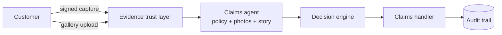

# Bayyina

**Proof before payout.**

Bayyina is a trusted-evidence claims platform for insurers. It proves that claim photos are real, then lets an AI agent read the evidence and the policy and prepare a cited decision file for a human claims handler.

> Status: research and design stage (POC proposal for GBS). No production code yet.

---

## The problem

Insurers now settle most motor and home claims from photos instead of sending an expert. That saves money, but every photo has become an attack surface.

- Image generators can now produce photorealistic car and property damage in seconds.
- Allianz reported a **300% rise** in doctored claim photos between 2022 and 2023.
- **98% of insurers** say AI editing tools are increasing digital fraud (Verisk).
- Insurance fraud costs an estimated **$308bn a year in the US alone**, $45bn of it in property and casualty.

Today's answer is to detect fakes after upload. Detectors fall behind every time a new generator ships, so that approach keeps losing ground.

## The idea

Bayyina changes the order of operations:

1. **Prove at capture.** Photos taken in the Bayyina capture flow are hashed and signed on the device at the moment they are taken. Any later edit breaks the signature.
2. **Check what is not proven.** Photos uploaded from a gallery go through forensic checks: metadata, compression analysis, AI-image detection, and reuse across past claims.
3. **Reason with the policy.** An AI agent reads the trusted photos, the policy wording and the customer's story in their own language (Darija, Arabic, French, English…). It returns a structured file with a coverage verdict, the clause ids it relied on, visible damage, a cost range, inconsistencies and missing documents.
4. **A human decides.** The handler approves, asks for information, refers to investigation or rejects. Every step is written to a tamper-evident audit trail.

## Who it is for

- **Mid-size insurers and brokers** who cannot afford to combine three separate vendors for capture, fraud and claims automation.
- **Claims outsourcing hubs (GBS / shared services)** that process claims for European carriers and need speed and a clean audit trail.
- **Emerging markets** (MENA, Africa, Latin America), where multilingual intake and mobile-first customers are the norm.

## What makes it different

| | Signed capture | Forensics | Policy reasoning | Multilingual intake |
|---|:-:|:-:|:-:|:-:|
| Damage estimation vendors | – | partial | – | – |
| Fraud analytics platforms | – | ✓ | partial | partial |
| Secure capture SDKs | ✓ | – | – | – |
| **Bayyina** | ✓ | ✓ | ✓ | ✓ |

Bayyina does not try to beat specialist damage estimators. It integrates with them later.

## POC scope (6 weeks)

The POC is built to answer five questions:

| # | Hypothesis | How we measure it |
|---|---|---|
| H1 | Signed capture removes most fake-photo risk with little friction | Capture done in under 2 minutes; every post-capture edit detected |
| H2 | Forensics catch most fakes among unsigned uploads | Recall ≥ 85% at ≤ 10% false alarms on a labelled benchmark |
| H3 | The agent applies policy clauses reliably when it must cite them | ≥ 85% agreement with an expert on 50 claims; every verdict cites a real clause |
| H4 | Customers can write in their own language | Same incident type in ≥ 90% of Darija / Arabic / French / mixed cases |
| H5 | Handlers save time and trust the file | Decision in minutes instead of days; usefulness rated ≥ 4/5 |

## Documentation

| Document | What is inside |
|---|---|
| [docs/RESEARCH.md](docs/RESEARCH.md) | Market scan, competition, problem evidence, hypotheses, data plan, risks, sources |
| [docs/ARCHITECTURE.md](docs/ARCHITECTURE.md) | Components, data model, trust scoring, technology choices, decision records |
| [docs/SYSTEM_DESIGN.md](docs/SYSTEM_DESIGN.md) | Request flows, scaling, reliability, security threat model, privacy, cost, deployment |
| [docs/overview.html](docs/overview.html) | One-page visual overview for clients (open in a browser) |

## Planned stack

| Layer | POC | Production path |
|---|---|---|
| Capture | Progressive web app with WebCrypto signing | Native iOS / Android with C2PA manifests and hardware attestation |
| API and services | Python, FastAPI | Same, split into services behind a gateway |
| Forensics | Pillow, NumPy, perceptual hashing, one open AI-image detector | Detector ensemble on GPU workers |
| AI agent | Frontier multimodal LLM with structured JSON output | Same, plus evaluation harness and model routing |
| Data | PostgreSQL, object storage | PostgreSQL with pgvector, regional object storage, event bus |
| Handler console | React / Next.js | Same, with SSO and role-based access |

## Roadmap

1. **Research and design** (current): this repository's documents.
2. **POC** (6 weeks): signed capture, forensics, claims agent, handler console, evaluation report.
3. **Pilot** (3 months): one insurer, one line of business, anonymised real claims, native capture app.
4. **Product**: integrations with core claims systems, more lines (home, travel, health documents), more countries.

## Responsible AI

- The AI never makes the final decision. A named handler does.
- Every verdict must cite the policy clause it relies on, or say that information is missing.
- Overrides of the AI are recorded and reviewed.
- Designed to meet the EU AI Act's expectations for oversight, logging and documentation, and local data laws (Morocco law 09-08 / CNDP, GDPR).

## Author

Anass El Alaoui. AI / ML engineer and full-stack developer.
