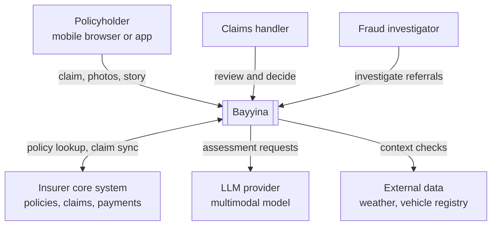
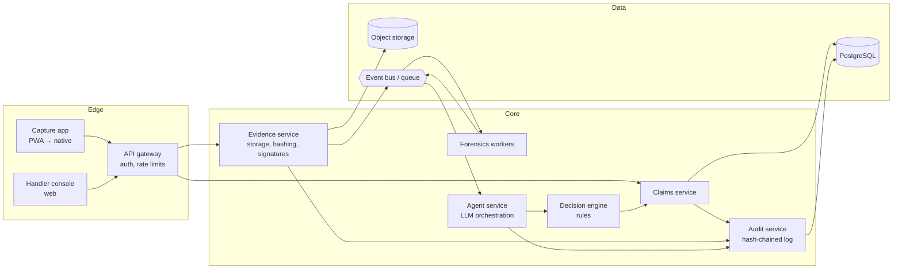
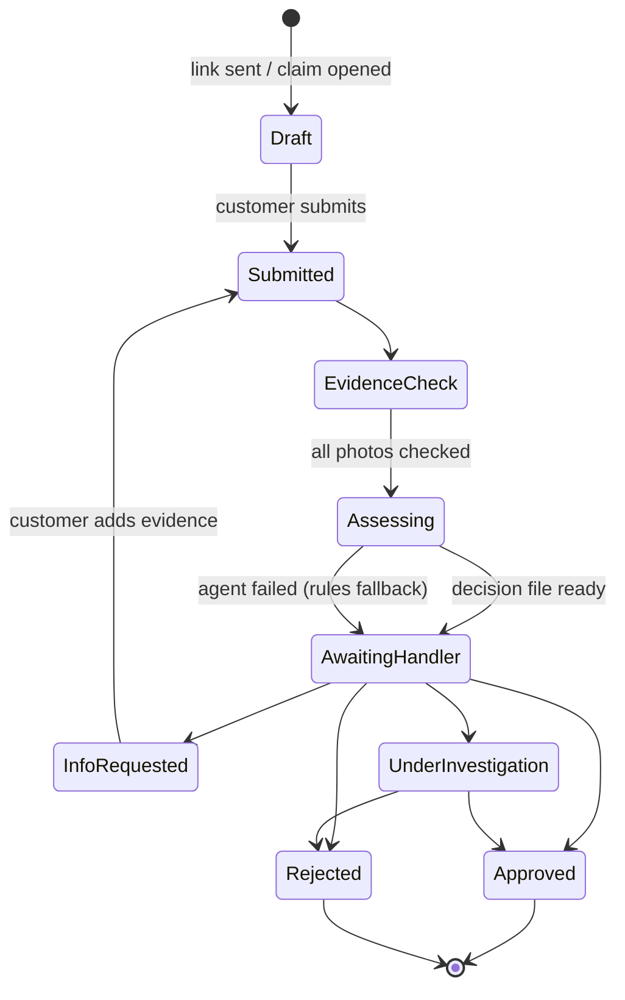
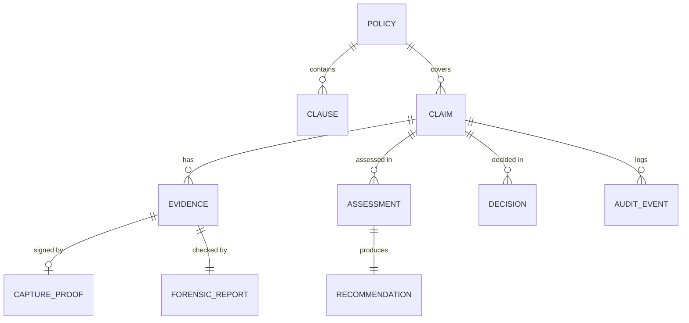

# Bayyina architecture

This document describes what Bayyina is made of and why. For how it behaves under load, failure and attack, see [SYSTEM_DESIGN.md](SYSTEM_DESIGN.md).

## 1. Principles

1. **Trust is computed, not assumed.** Every photo carries an explicit trust status and the signals behind it.
2. **Proof beats detection.** A valid capture signature outweighs any detector score. Detection only covers what was not proven.
3. **The AI drafts, a human decides.** No claim is paid or rejected without a named handler.
4. **Every conclusion is traceable.** Verdicts cite policy clauses; scores list their signals; every step goes into the audit trail.
5. **Fail safe.** If a model or detector is down, the claim goes to a human with a clear note. It is never approved automatically.
6. **Start as a modular monolith.** One deployable for the POC, with module boundaries that can become services later.

## 2. System context

## 3. Containers

| Container | Responsibility | Key technology |
|---|---|---|
| Capture app | Guided photo capture, on-device hashing and signing, offline queue | PWA with WebCrypto (POC); native app with C2PA and hardware attestation (pilot) |
| Handler console | Claim queue, evidence viewer, forensic overlays, decision file, decision buttons | React / Next.js |
| API gateway | Authentication, rate limits, request size limits, routing | Managed gateway or Nginx |
| Claims service | Claim lifecycle and state machine, handler decisions | Python / FastAPI |
| Evidence service | Stores originals, computes hashes, verifies signatures and C2PA manifests, issues capture nonces | Python, `cryptography`, C2PA libraries |
| Forensics workers | Metadata checks, error level analysis, AI-image detection, perceptual hashing, duplicate search | Python, Pillow, NumPy, PyTorch (detector) |
| Agent service | Builds the model input, calls the LLM with a strict schema, validates output, falls back to rules | Python, LLM SDK |
| Decision engine | Combines trust and assessment into a recommended action | Versioned rules in code |
| Audit service | Append-only, hash-chained event log | PostgreSQL table + periodic anchoring |

## 4. Claim lifecycle

## 5. Data model

| Entity | Main fields |
|---|---|
| Policy | id, country, currency, line, holder ref, insured object, validity dates, guarantees, deductibles |
| Clause | id, policy id, guarantee, text, version |
| Claim | id, policy id, channel, incident date, description, language, status |
| Evidence | id, claim id, object key, sha256, perceptual hash, media type, captured at |
| Capture proof | evidence id, nonce, device public key, signature, attestation token, C2PA manifest, verification result |
| Forensic report | evidence id, signals (code, points, reason), risk score, detector versions |
| Assessment | claim id, model id, prompt version, structured output, confidence, latency, token usage |
| Recommendation | assessment id, action, reasons, payable range, evidence trust score, rules version |
| Decision | claim id, handler id, action, note, overrode AI (yes/no) |
| Audit event | sequence, claim id, actor, event, payload, previous hash, hash |

Every assessment stores the model id and prompt version so any decision can be replayed and explained later.

## 6. Evidence trust scoring

Each photo receives one provenance status and one forensic risk score.

| Provenance status | Meaning |
|---|---|
| `verified_capture` | Signed on device during this claim session; file unchanged since |
| `unverified_upload` | No signature (gallery, email, WhatsApp forward) |
| `invalid` | Signature present but broken, expired or replayed |

Forensic risk (0–100) is the sum of explainable signals, capped at 100:

| Signal | Points (POC starting values) |
|---|---|
| Metadata names an image generator or contains a prompt | 60 |
| Near-duplicate of evidence in another claim | 45 |
| Edited with known editing software | 25 |
| Strong uneven recompression (ELA) | 25 |
| AI-image detector above threshold | 40 |
| No camera metadata (ignored when capture is verified) | 15 |

The decision engine then applies simple, readable rules:

| Condition | Action |
|---|---|
| Any `invalid` proof, or any photo risk ≥ 50 | Refer to investigation |
| Coverage needs information | Request information |
| All photos verified, risk < 20, coverage clear, agent confidence ≥ 0.7 | Fast track (handler still confirms) |
| Anything else | Handler review |

Weights and thresholds are tuned on the labelled benchmark (hypothesis H2) and versioned with the rules.

## 7. Claims agent design

- **Input:** up to 8 resized photos, policy JSON with clause ids, repair price table, customer story, evidence findings.
- **Output:** strict JSON schema: summary, language, incident type, coverage (verdict, guarantee, clause ids, reasoning), damage (parts, low/high estimate, currency), inconsistencies, missing information, fraud signals, recommended action, confidence.
- **Guardrails:**
  - Clause ids in the output must exist in the policy, or the output is rejected and retried once.
  - Customer text and image content are treated as data. Instructions found inside them are ignored (see prompt-injection threat in SYSTEM_DESIGN).
  - The agent describes only damage it can see, and gives a range, not a single number.
- **Fallback:** if the model is unavailable or refuses, a rules-based assessment runs and the claim is marked for handler review.
- **Evaluation:** a fixed set of 50+ labelled claims runs on every prompt or model change; results are stored next to the prompt version.

## 8. Technology choices

| Need | Choice | Why |
|---|---|---|
| Backend language | Python | Same language for ML, forensics and API; fastest for one engineer |
| API framework | FastAPI | Typed, async, automatic OpenAPI docs |
| Database | PostgreSQL | Relational claims data, JSONB for model output, pgvector later for embeddings |
| Files | S3-compatible object storage | Cheap, regional, supports object lock for evidence |
| Queue | Redis streams (POC) → managed queue | Forensics and LLM calls are slow and must not block uploads |
| Front end | Next.js | One stack for console and capture PWA |
| Signing | WebCrypto ECDSA P-256 (POC) → C2PA + platform attestation | Works in any browser today, clear upgrade path |
| LLM | Frontier multimodal model with structured output | Needs vision, long policy context and multilingual input |

## 9. Architecture decision records

**ADR-001 Proof before detection.** Detectors age as generators improve; signatures do not. Detection is kept for unsigned evidence only.

**ADR-002 Modular monolith for the POC.** One engineer, six weeks. Module boundaries (claims, evidence, forensics, agent, decision, audit) match future services.

**ADR-003 Rules engine after the LLM.** The final recommendation comes from versioned, readable rules, not from the model alone. This keeps behaviour predictable and auditable.

**ADR-004 Human decision is mandatory.** Required for trust, for regulators (EU AI Act human oversight), and because the POC has not yet proven accuracy on real claims.

**ADR-005 Integrate, don't compete, on damage estimation.** Specialists have years of labelled photos. Bayyina uses a price table for the POC and plugs in an estimator for production.

**ADR-006 Hash-chained audit log.** Each event stores the hash of the previous one, so silent edits by insiders are detectable.
