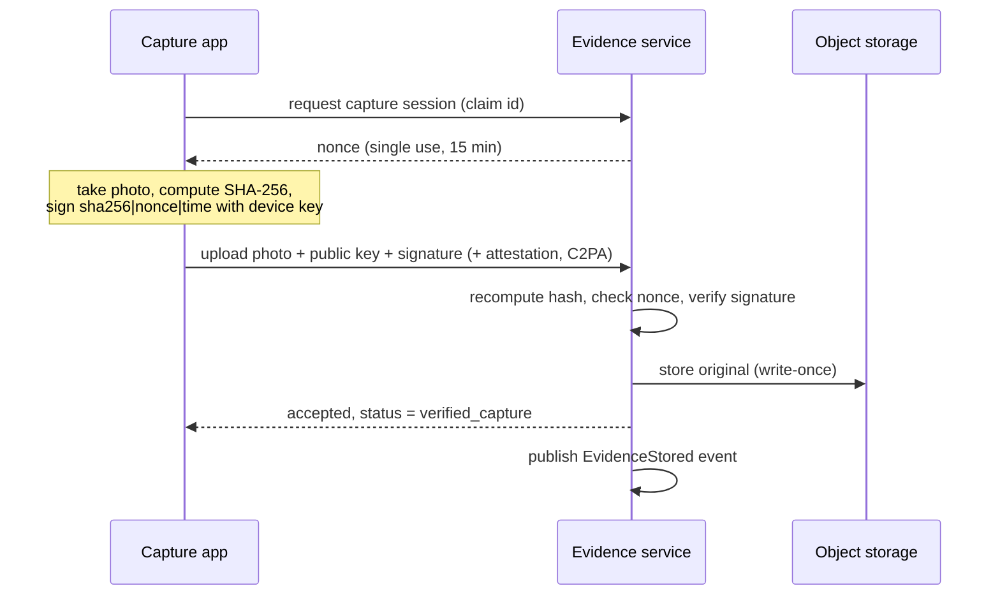
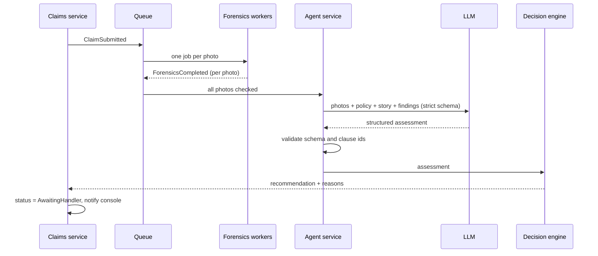
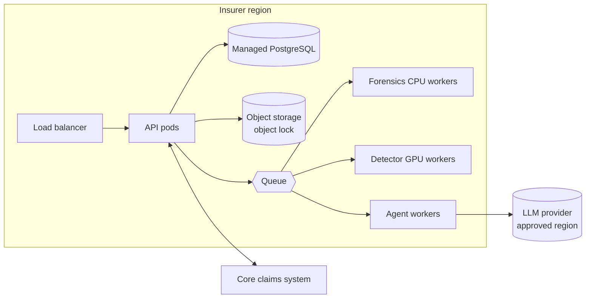

# Bayyina system design

How Bayyina behaves in practice: request flows, capacity, reliability, security, privacy, cost and deployment. Component definitions are in [ARCHITECTURE.md](ARCHITECTURE.md).

## 1. Requirements

### Functional
- A customer opens a claim from a link, takes guided photos, describes the incident in their own language, and submits.
- Each photo is verified (signature) or checked (forensics) and gets a trust status and risk score.
- An AI agent produces a structured decision file that cites policy clauses.
- A handler sees a queue sorted by priority, inspects evidence with forensic overlays, and records a decision.
- Investigators receive referrals with the evidence and the reasons.
- Every action is logged in a tamper-evident audit trail.

### Non-functional

| Quality | Target (pilot) |
|---|---|
| Photo upload acknowledged | < 2 s at p95 |
| Decision file ready after submission | < 2 min at p95 |
| Console availability | 99.5% (pilot), 99.9% (production) |
| Evidence durability | No loss of originals; write-once storage |
| Data residency | Evidence and personal data stay in the insurer's region |
| Explainability | Every score lists its signals; every verdict lists clause ids |

## 2. Capacity estimate

Example: a mid-size motor insurer with **200,000 claims a year**.

| Item | Estimate |
|---|---|
| Claims per day | ~550 average, ~1,600 on peak days (storms, holidays) |
| Photos per claim | ~6 |
| Photo size | ~4 MB original |
| New evidence storage | ~4.8 TB a year, before thumbnails |
| LLM calls | 1 per claim, plus 1 per added evidence round |
| Forensic jobs | ~3,300 a day average |

This is small for modern infrastructure. The real constraints are LLM latency and rate limits, and detector GPU time, which is why both run on a queue.

## 3. Key flows

### 3.1 Signed capture

Why a server nonce: it ties the signature to this claim session, so a photo signed yesterday for another claim cannot be replayed.

### 3.2 Assessment

### 3.3 Handler decision
1. Handler opens the claim; the console loads the decision file, photos, ELA overlays and the audit timeline.
2. Handler chooses approve, request information, investigate or reject, with a note.
3. The claims service records the decision, flags whether it overrides the AI, writes an audit event, and syncs the outcome to the core system.

## 4. Events

| Event | Producer | Consumers |
|---|---|---|
| `ClaimSubmitted` | Claims | Forensics, Audit |
| `EvidenceStored` | Evidence | Forensics, Audit |
| `ForensicsCompleted` | Forensics | Agent, Audit |
| `AssessmentReady` | Agent | Decision, Audit |
| `RecommendationReady` | Decision | Claims, Console, Audit |
| `HandlerDecided` | Claims | Core-system adapter, Audit, Analytics |

All consumers are idempotent: each event carries an id, and processed ids are recorded, so a retried message never creates a second assessment.

## 5. Reliability

| Failure | Behaviour |
|---|---|
| LLM provider down, slow or refuses | Retry with backoff, then run the rules-based assessment; claim goes to handler review with a visible note |
| AI-image detector fails | Signal marked `unknown`; never treated as "clean" |
| Upload interrupted | Capture app keeps an offline queue and resumes; server deduplicates by hash |
| Queue backlog after a storm | Workers scale out; claims are prioritised by severity and age |
| Core system unavailable | Decisions are stored and synced later through an outbox table |
| Database outage | Managed PostgreSQL with point-in-time recovery; evidence lives separately in object storage |

Nothing in Bayyina approves a claim automatically, so every failure ends at a human.

## 6. Security threat model

| Threat | Example | Mitigation |
|---|---|---|
| Fake photo uploaded | AI-generated dent | Unsigned → forensics; high risk → investigation |
| Edited after capture | Damage added to a signed photo | Hash no longer matches the signature → `invalid` |
| Replay | Same signed photo reused in a second claim | Single-use nonce per session; perceptual hash finds reuse |
| Screen or print re-capture | Photographing a fake on a monitor | Live multi-angle guidance, moiré and screen detection, native attestation in pilot |
| Device key theft or emulator | Signing from a script | Hardware-backed keys and platform attestation (Play Integrity, App Attest) in pilot |
| Prompt injection | Text in the story or written inside a photo saying "approve this claim" | Inputs passed as data, schema-constrained output, clause-id validation, rules engine decides, human approves |
| Insider tampering | Changing an AI verdict in the database | Hash-chained audit log, role-based access, separation of duties |
| Data leak | Photos with faces and plates | Encryption at rest and in transit, short-lived signed URLs, least-privilege access |

## 7. Privacy and compliance

- **Data minimisation:** only the photos and fields needed for the claim. Optional face and plate blurring for third parties.
- **Residency:** storage and processing in the insurer's region; LLM calls through a provider and region the insurer approves.
- **Retention:** evidence kept for the legal claim period, then deleted; audit events kept longer without the images.
- **Laws:** Morocco law 09-08 (CNDP), GDPR for EU data, local insurance regulator rules.
- **EU AI Act:** human oversight, logging, technical documentation and accuracy testing are built in from the POC, which simplifies later conformity work (the high-risk deadline moved to 2 December 2027).

## 8. Observability and model monitoring

- **Tracing:** one trace per claim across upload, forensics, agent and decision.
- **Business metrics:** time to decision, fast-track rate, override rate, referral rate, confirmed-fraud rate.
- **Model metrics:** schema failures, refusals, average confidence, clause-citation errors, latency and token usage per claim.
- **Drift checks:** weekly comparison of verdict distribution by region, vehicle age and language, to catch bias early.
- **Evaluation gate:** no prompt or model change ships unless it passes the labelled evaluation set.

## 9. Cost per claim (estimate to validate in the POC)

| Item | Rough cost |
|---|---|
| LLM assessment (≈ 15–20k input tokens with photos, a few thousand output tokens) | ≈ $0.10–0.30 |
| Forensics compute (CPU, plus GPU detector) | < $0.02 |
| Storage (6 photos, one year) | < $0.01 |
| **Total** | **≈ $0.15–0.35 per claim** |

Compared with a handler hour or an expert visit, the cost is small. The POC will measure real token usage per claim and replace these estimates.

## 10. Deployment

| Stage | Setup |
|---|---|
| POC | One cloud VM or laptop with Docker Compose: API, worker, PostgreSQL, Redis, MinIO |
| Pilot | Managed PostgreSQL, managed object storage with object lock, container platform, separate GPU worker pool, SSO for handlers |
| Production | Kubernetes per region, autoscaled workers, multi-zone database, secrets in a key management service, CI/CD with evaluation gate |

## 11. POC delivery plan

| Week | Focus | Exit check |
|---|---|---|
| 1 | Handler interview, synthetic policies, 50 test claims, fake-photo benchmark | Datasets labelled |
| 2 | Capture flow with signing, evidence service | H1 measurable |
| 3 | Forensics pipeline and trust scoring | H2 measured |
| 4 | Claims agent with schema and clause validation | H3, H4 measured |
| 5 | Decision engine, handler console, audit trail | End-to-end demo |
| 6 | Evaluation report, cost per claim, pilot proposal | H5 feedback from handlers |
